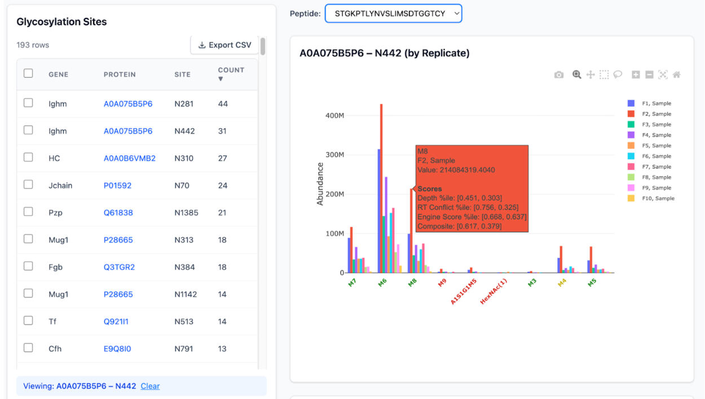

# GlycoViz #

Glycan analysis application with build-in glycan validation algorithm  using React + FastAPI + PostgreSQL.


# User Guide #
Please find the user guide under the root folder. 

## Architecture

- **Frontend:** React 18 + TypeScript + Vite + Tailwind CSS + react-plotly.js
- **Backend:** FastAPI + Python 3.11+ + SQLAlchemy + Alembic
- **Database:** PostgreSQL
- **Charts:** Plotly (via react-plotly.js)

## Quick Start

### With Docker Compose

```bash
docker-compose up
```

- Frontend: http://localhost:5173
- Backend API: http://localhost:8000/api/docs
- PostgreSQL: localhost:5432

### Manual Development

**Backend:**
```bash
cd backend
python -m venv venv
source venv/bin/activate
pip install -e ".[dev]"
uvicorn app.main:app --reload
```

**Frontend:**
```bash
cd frontend
npm install
npm run dev
```

## Project Structure

```
├── backend/          # FastAPI application
│   ├── app/
│   │   ├── api/      # Route handlers
│   │   ├── core/     # Algorithm modules (glycan converter, clustering, etc.)
│   │   ├── db/       # Database session & migrations
│   │   ├── models/   # SQLAlchemy ORM models
│   │   ├── schemas/  # Pydantic request/response schemas
│   │   └── services/ # Business logic
│   └── tests/
│   └── example_data/  # Sample input files (Byonic, MSFragger, etc.)
├── frontend/         # React + TypeScript application
│   └── src/
│       ├── api/       # API client
│       ├── components/ # Reusable UI components
│       ├── pages/     # Route-level pages
│       ├── hooks/     # Custom React hooks
│       └── types/     # TypeScript type definitions
└── docker-compose.yml
```
