# GlycoViz User Manual

## Installation

1. Install Docker Compose on your machine: https://docs.docker.com/compose/install/
2. Download GlycoViz code from https://github.com/calico/glycoviz. The code can be download by clicking "Code -> Download ZIP" or click "releases" sections. 
3. Open a terminal, navigate to the downloaded `glycoviz` directory (e.g., `cd glycoviz`), run the command `docker-compose up`. 
4. The web app should be accessible from http://localhost:5173

No manual configuration is required for local installation above. 

**Hosting as a shared server:** GlycoViz can also be deployed on a shared server so that multiple users can access it through a web browser without installing anything locally. Deploy the same Docker Compose setup on a server machine, and users can access the application by navigating to the server's IP address or hostname (e.g., `http://your-server:5173`). The application runs on FastAPI, an asynchronous web framework, so a single instance should comfortably support dozens of concurrent users for analyzing and reviewing results. For production deployments, consider placing a reverse proxy (e.g., nginx) in front of the application to handle HTTPS and domain routing. On multi-core servers, the backend can be configured with multiple worker processes to run analyses in parallel.

## API Access

The application is built on a REST API (FastAPI) that powers all frontend functionality. Any operation available in the UI — uploading data, running analyses, retrieving abundance data, computing fold changes — can also be performed programmatically via HTTP requests. The interactive API documentation is available at `/docs` (Swagger UI) or `/redoc` when the backend server is running, e.g. for a local instance, the API docs are at http://localhost:5173/api/docs or http://localhost:8000/docs, depending on proxy settings.

---

## Manual

The workflow consists of three stages: (1) configure and upload, (2) run analysis, and (3) explore results.

---

## Getting Input Files from Search Engines

GlycoViz supports flexible column mapping through the "Column Settings" panel on the home page for input files. It is not tied to a specific software version or search engine. Users can modify the existing Byonic or MSFragger header mappings, or use the "Customized" profile to define column names for any search engine or software version. As long as several key columns — Protein Accessions, Modifications (or Glycan Composition, or even glycan masses alone), and Sequence — are available, the application can process the data. Changes are saved persistently and applied automatically during future uploads.

For detailed examples of how to export data from different search engines and configure column mappings, see the [Input Examples](#input-examples) section at the end of this manual.

---

## 1. Data Upload and Configuration

### 1.1 Uploading a Data File

From the home page, drag and drop a search engine results file into the upload zone, or click to browse. Supported formats include `.xlsx`, `.tsv`, and `.csv`. GlycoViz automatically detects the search engine format (Byonic, MSFragger, or your customized headers) by matching column headers against the configured header sets. The detected format is displayed below the upload zone. All input file headers can be self-defined in the UI.

### 1.2 Column Header Settings

The Column Settings table defines how GlycoViz maps your file's column headers to internal field names. Multiple presets are provided:

- **Byonic-pd** — default mapping for Byonic search results exported from Proteome Discoverer
- **Byonic-standalone** — mapping for Byonic standalone `.byrslt` exports
- **MSFragger-psm** — mapping for MSFragger/FragPipe PSM output
- **MSFragger-combinedions** — mapping for MSFragger combined ion output
- **Customized** — a user-editable template for other search engines

Each row corresponds to a required field. Required fields are bold in the table. See tooltips in the UI for instructions. The Abundance Columns field supports `*` wildcards to match multiple samples. When the Abundance Columns field is left empty, a placeholder column with value 1 is added for all rows, enabling identification-only datasets to be processed.

Several example data files from Byonic and MSFragger are provided which can be downloaded from the link in the screenshot below.

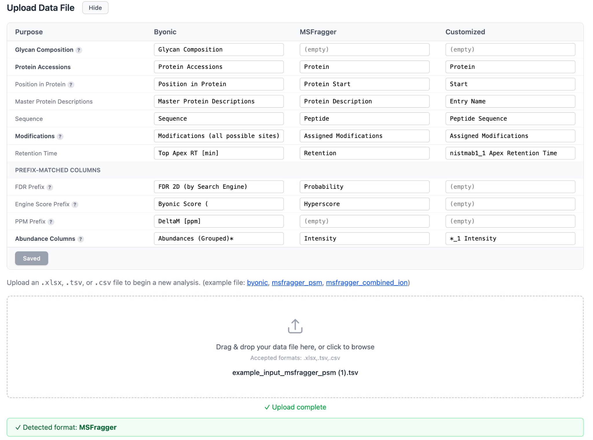

### 1.3 Condition Assignment and Analysis Parameters

After uploading, GlycoViz displays the detected abundance columns. Assign each sample to a condition (e.g., "Control", "Treatment") and provide an analysis name. Adjust filters and click "Run Analysis" to begin processing.

If the dataset contains only a single condition, the volcano plot and heatmap will not load because they rely on differential analysis between conditions.

**Min Count Threshold** filters out glycans that don't appear in enough samples. Specifically:
- For each glycan row, it counts how many abundance columns have a positive value (i.e., how many samples detected that glycan).
- If that count is less than the threshold, the row is skipped/excluded from the analysis.

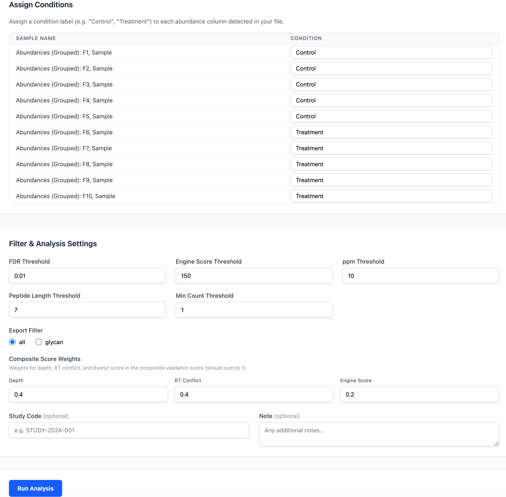

---

## 2. Analysis Results

After analysis completes, click the analysis row in the Saved Analyses table to view results. The analysis page displays QC statistics (total proteins, peptides, glycopeptides, unique glycans, and sites) along with interactive visualizations.

### 2.1 Plot Controls

Three toggle groups at the top control all charts simultaneously:

- **Type:** Glycan or Motif — switch between individual glycan compositions and grouped motif categories (Fucosylation, High Mannose, Galactosylation, etc.)
- **Metric:** Abundance or Count — show summed intensities or spectral counts
- **Scale:** Absolute or % — display raw values or percentages of total

### 2.2 Global Abundance Bar Charts

Two bar charts display glycan or motif abundance across all sites:

- **By Replicate** — each sample is a separate bar, showing raw per-sample values
- **By Condition** — samples are grouped by condition, showing mean +/- standard error

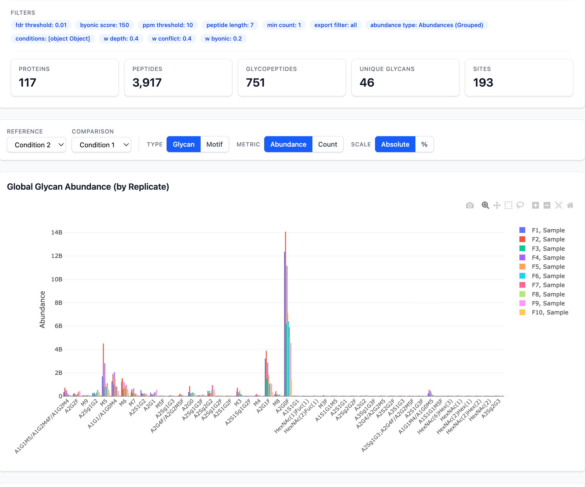

### 2.3 Volcano Plot and Fold Change Analysis

This plot is only available if there are more than 1 condition defined when uploading the file. Select a reference and comparison condition to generate:

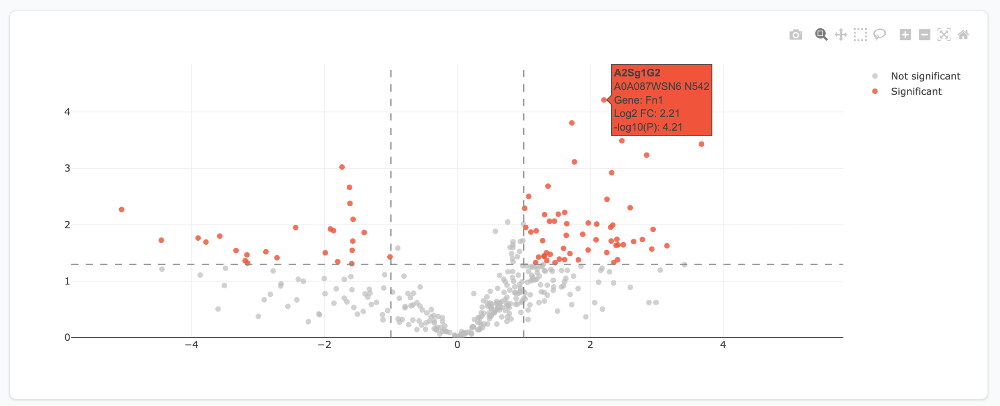

---

## 3. Site-Level Exploration

### 3.1 Glycosylation Sites Table

The left panel lists all identified glycosylation sites with gene name, protein accession, site position, and spectral count. Click any row to view per-site abundance charts in the right panel. Use checkboxes to select multiple sites, then click Display figures for all checked rows to view combined abundance data. The table is sortable and exportable to CSV.

### 3.2 Per-Site and Multi-Site Charts

Selecting a single site shows two bar charts (by replicate and by condition) specific to that glycosylation site, with composite validation score coloring. Selecting multiple sites via checkboxes shows combined abundance charts aggregated across all selected sites. Clicking a protein accession link navigates to the protein glycosylation map.

The detailed scoring matrix is available when hovering on a data point.

**Real-Time Composite Score Rescoring:** The composite validation score weights (Depth, RT Conflict, and Engine Score) can be recalculated using controls next to the "Glycosylation Sites" header. Changing these weights instantly recalculates the composite scores and updates the glycan label colors without modifying the saved analysis files. To ignore a metric entirely (e.g., RT Conflict), simply set its weight to 0 — the remaining weights are automatically normalized so the composite score stays on a 0-1 scale.

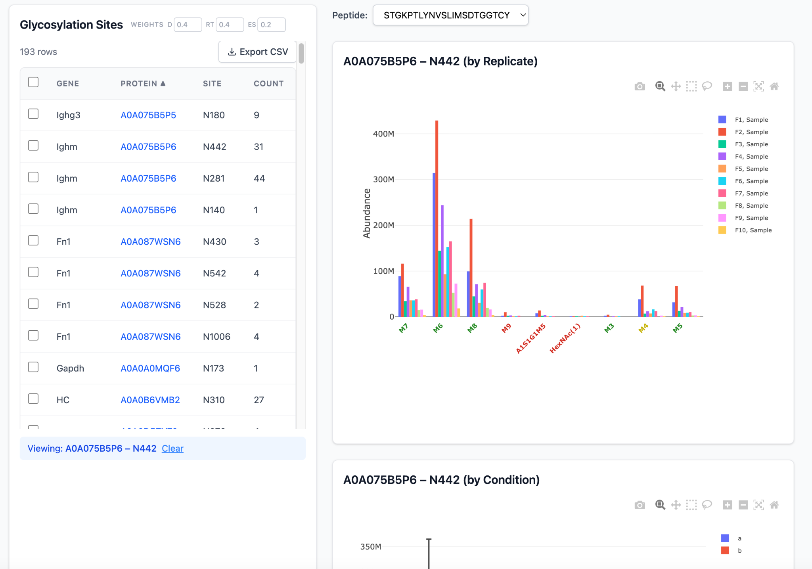

---

## 4. Heatmap and Clustering

Click View Heatmap from the analysis page to open the clustering visualization. Configure clustering parameters:

- **Cluster by:** rows, columns, or both
- **Distance metric:** Euclidean, Manhattan, Maximum, or Minkowski
- **Linkage method:** Complete, Single, or Average
- **Transformations:** Centered Log Ratio (CLR), Z-score normalization, and fold change filtering (minimum threshold, default >= 4)
- **K-Means:** optional k-means pre-clustering (k = 2-20)

Click Generate Heatmap to compute. The result displays an interactive heatmap with hierarchical dendrograms on rows and/or columns, using a cyan-black-yellow color scale centered at zero for log-ratio transforms.

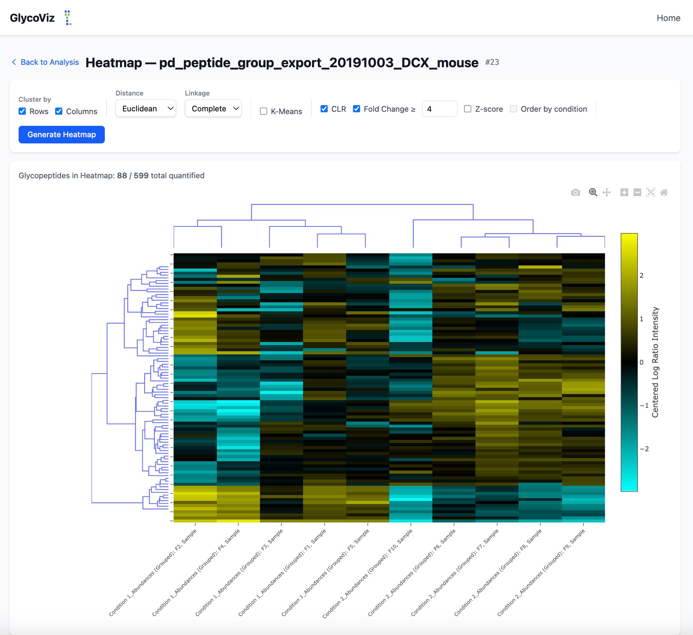

---

## 5. Protein Glycosylation Map

Click a protein accession name from the sites table to view the interactive glycosylation map. This page displays:

- An SVG diagram of the protein backbone with colored circles at each glycosylation site, color-coded by motif (High Mannose, Complex/Hybrid, Fucosylated, Sialylated, Paucimannose)
- Known glycosylation sites from UniProt (displayed in a sidebar table)
- A p-value filter slider to show only statistically significant sites

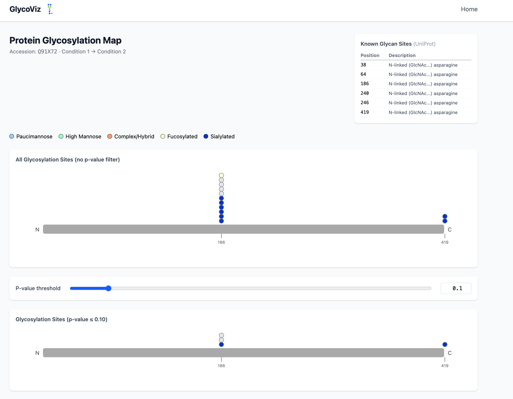

---

## 6. Managing Analyses

The Saved Analyses table on the home page lists all completed analyses with name, study code, parameters, and creation date. Click any row to view results. Click the Parameter link to inspect all filter settings used. To delete an analysis and all associated files, click the Delete button at the end of row and type "DELETE" to confirm.

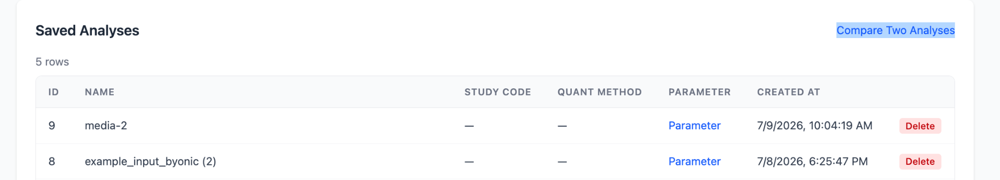

---

## 7. Compare Two Analyses

This page allows users to select two saved analyses (which could be from different search engines, different parameters, etc.) and perform a simple, table-based side-by-side comparison of global statistics, identified glycans, and glycosylation sites, though the comparison is less quantitative compared with the main analysis page.

To compare results from two analyses, click the "Compare Two Analyses" link next to the "Saved Analyses" header on the home page.

On the comparison page, select two analyses from the dropdown menus and click "Compare." The page displays a side-by-side comparison of global statistics (proteins, peptides, glycopeptides, unique glycans, and sites) and a paginated glycosylation sites table showing the count of identifications from each analysis. Click any row in the sites table to view the glycans identified at that site in each analysis, displayed in a panel to the right. An optional "Identified Glycans" table can be toggled on to show all globally identified glycans across both analyses. All comparison tables support sorting and CSV export.

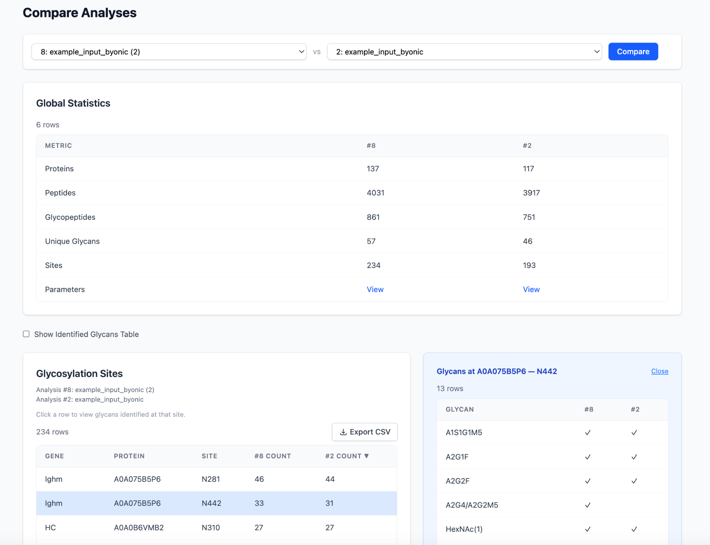

---

## Input Examples

### Example 1 — Byonic (Proteome Discoverer export)

Export from Proteome Discoverer: File > Export > To Microsoft Excel, select "Peptide Groups" at Level 1.

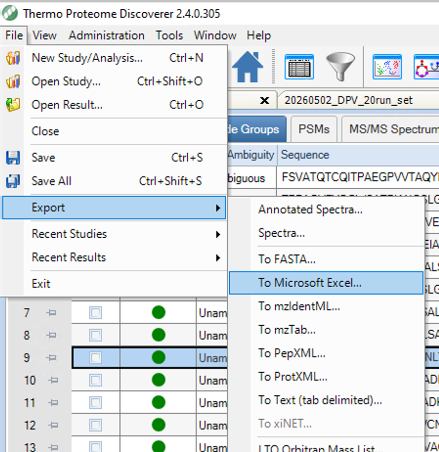

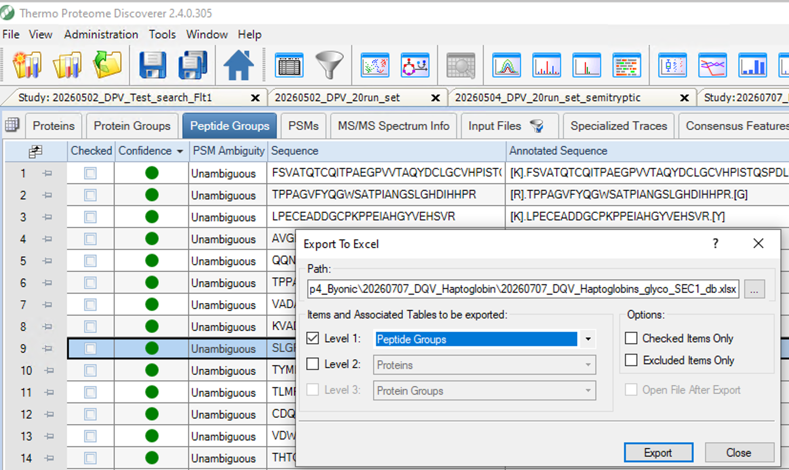

### Example 2 — MSFragger PSM (FragPipe v23)

File: `example_input_msfragger_psm.tsv` — single PSM file.

Example column mapping:
```json
{
  "glycan_composition": "",
  "protein_accessions": "Protein",
  "position_in_protein": "Protein Start",
  "master_protein_descriptions": "Protein Description",
  "sequence": "Peptide",
  "modifications": "Assigned Modifications",
  "modifications_fallback": "",
  "retention_time": "Retention",
  "fdr_prefix": "Probability",
  "engine_score_prefix": "Hyperscore",
  "ppm_prefix": "",
  "abundance_columns": "Intensity"
}
```

### Example 3 — MSFragger Combined Ion (FragPipe v23)

File: `example_input_msfragger_combined_ion.tsv` — with two samples. Intensity columns are "nistmab1_1 Intensity" and "nistmab2_1 Intensity".

Example column mapping using wildcard match `*_1 Intensity`:
```json
{
  "glycan_composition": "",
  "protein_accessions": "Protein",
  "position_in_protein": "Start",
  "master_protein_descriptions": "Entry Name",
  "sequence": "Peptide Sequence",
  "modifications": "Assigned Modifications",
  "modifications_fallback": "Modifications",
  "retention_time": "nistmab1_1 Apex Retention Time",
  "fdr_prefix": "",
  "engine_score_prefix": "",
  "ppm_prefix": "",
  "abundance_columns": "*_1 Intensity"
}
```

### Example 4 — MSFragger (FragPipe v24.0, public data)

File: `713336_file03.tsv` from msfragger-glyco, FragPipe v24.0.
Source: https://www.biorxiv.org/content/10.64898/2026.03.21.713336v1.supplementary-material

One file with multiple samples. Intensity column headers for each sample are: `Intensity pool_1`, `Intensity A21`, `Intensity B21`, `Intensity C21`, etc.

Example column mapping using wildcard match `Intensity *`:
```json
{
  "glycan_composition": "",
  "protein_accessions": "Protein",
  "position_in_protein": "Protein Start",
  "master_protein_descriptions": "Protein Description",
  "sequence": "Peptide",
  "modifications": "Assigned Modifications",
  "modifications_fallback": "",
  "retention_time": "Retention",
  "fdr_prefix": "Probability",
  "engine_score_prefix": "Hyperscore",
  "ppm_prefix": "",
  "abundance_columns": "Intensity *"
}
```

### Example 5 — Byonic Standalone

Open Byonic `.byrslt` file from Byonic Viewer (screenshot from v6.0.33), select all proteins, then right click Peptides table, export unformatted CSV.

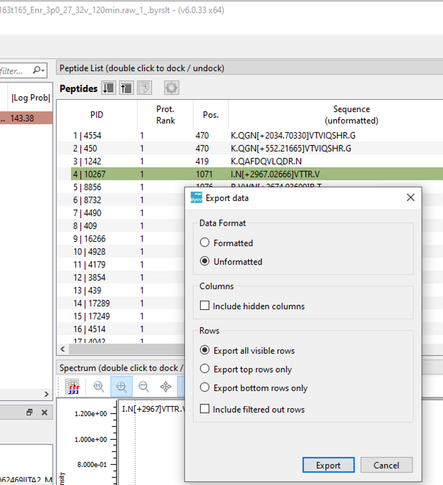

Source: https://www.ebi.ac.uk/pride/archive/projects/PXD030550
File: `ITA2_0221_0214_MK_WT_2X_R163t165_Enr_3p0_27_32v_120min.raw_1_.byrslt`

No intensity used.

Example column mapping:
```json
{
  "glycan_composition": "CompositionList",
  "protein_accessions": "ProteinName",
  "position_in_protein": "",
  "master_protein_descriptions": "ProteinName",
  "sequence": "Sequence",
  "modifications": "VariableFinalModNameList",
  "modifications_fallback": "Modifications",
  "retention_time": "ScanTimeList",
  "fdr_prefix": "PosteriorErrorProbability1_sum",
  "engine_score_prefix": "Score",
  "ppm_prefix": "MassErrPPM",
  "abundance_columns": ""
}
```

---

The application is provided "as is" without warranties of any kind.
